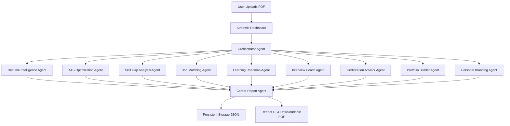
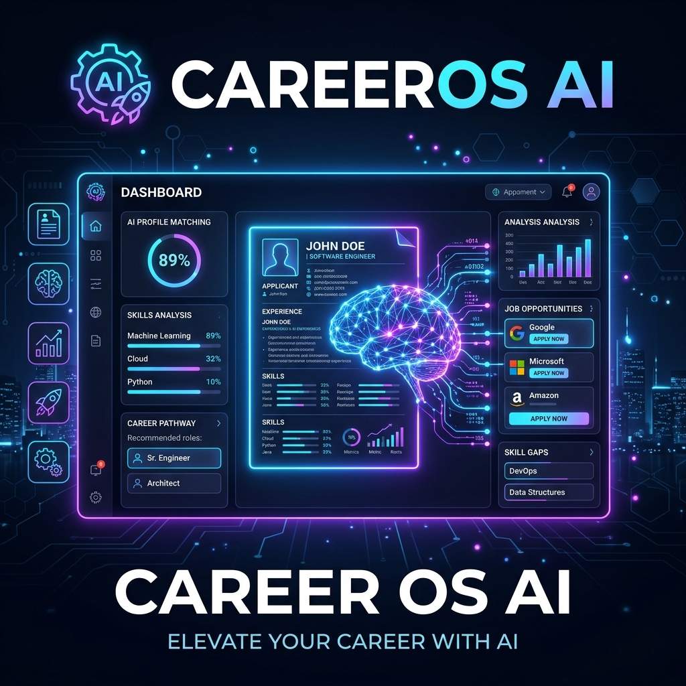
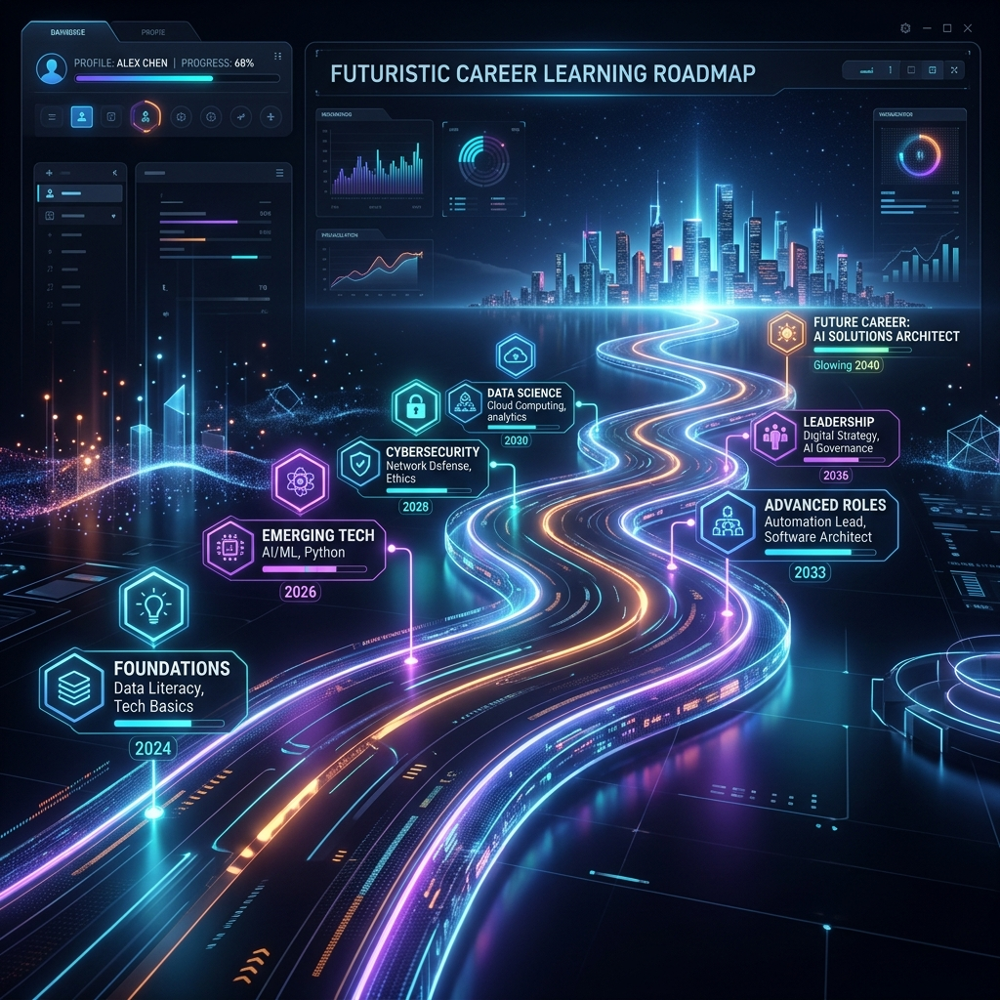

# CareerOS AI 💼

CareerOS AI is a powerful, autonomous multi-agent career operating system designed to guide students, fresh graduates, and job seekers through the complete lifecycle of career preparation.

This project was built for the **Kaggle AI Agents Intensive Vibe Coding Capstone Project**.

---

## 🎯 Problem Statement

The modern job search is incredibly fragmented. Candidates need separate tools to parse their resumes, evaluate ATS compatibility, identify skill gaps, find appropriate roles, prepare for interviews, and build portfolios. This disjointed process leads to confusion, sub-optimal applications, and high rejection rates.

## 💡 Solution Overview

**CareerOS AI** unifies the entire career preparation journey into a single, cohesive platform. By orchestrating 10 specialized AI agents powered by the Google Gemini API, CareerOS analyzes your resume, identifies exactly what you need to learn, generates a customized study plan, creates targeted interview questions, and helps you build a strong personal brand.

---

## ✨ Features

- **Resume Intelligence**: Parses unstructured PDF resumes into structured data.
- **ATS Optimization**: Calculates ATS scores and highlights missing keywords/formatting issues.
- **Skill Gap Analysis**: Compares your current skills against industry standards for your target role.
- **Intelligent Job Matching**: Evaluates your profile against 10 distinct IT roles and recommends career paths.
- **Automated Interview Coach**: Generates technical, HR, behavioral, and project-specific questions.
- **Dynamic Learning Roadmaps**: Builds customized 30/60/90-day actionable study plans.
- **Certification Advisor**: Recommends high-ROI certifications from Google, AWS, Microsoft, and Coursera.
- **Portfolio Builder**: Suggests targeted projects to bridge your specific skill gaps.
- **Personal Branding**: Automatically writes your LinkedIn headline, About section, and GitHub README intro.
- **Memory Persistence**: Saves your session data locally so you don't lose progress.
- **Comprehensive PDF Reports**: Generates a professional, downloadable Executive Career Report.

---

## 🏗️ Architecture Diagram



---

## 🤖 Multi-Agent Workflow

CareerOS utilizes an **Orchestrator Agent** to manage a sequential pipeline:
1. The **Resume Intelligence Agent** extracts data.
2. The **ATS Optimization Agent** and **Job Matching Agent** evaluate current standing.
3. The **Skill Gap Analysis Agent** identifies missing competencies.
4. The **Learning Roadmap Agent** and **Certification Advisor Agent** build the upskilling plan.
5. The **Portfolio Builder Agent** and **Personal Branding Agent** improve the candidate's public profile.
6. The **Interview Coach Agent** prepares them for the final hurdle.
7. The **Career Report Agent** synthesizes the data into a PDF report using `reportlab`.

---

## 📸 Gallery

<p align="center">
  
</p>

### 🧠 Multi-Agent Architecture


### 🗺️ Career Learning Roadmap


---

## ⚙️ Installation Instructions

### 1. Prerequisites
- Python 3.9+
- A Google Gemini API Key

### 2. Setup Environment
```bash
git clone https://github.com/yourusername/careeros-ai.git
cd careeros-ai
pip install -r requirements.txt
```

### 3. API Key
Copy the example env file and add your key:
```bash
cp .env.example .env
# Edit .env and insert GEMINI_API_KEY=your_key
```

### 4. Run Locally
```bash
streamlit run app.py
```

---

## 🚀 Deployment Instructions

CareerOS AI is designed to be easily deployed to **Streamlit Community Cloud**:

1. Commit and push this repository to GitHub.
2. Log in to [Streamlit Share](https://share.streamlit.io/).
3. Click **New app** and select your GitHub repository.
4. Set the main file path to `app.py`.
5. Under **Advanced Settings**, add your `GEMINI_API_KEY` to the Secrets management section.
6. Click **Deploy!**

---

## 🔮 Future Improvements

- **Web Search Agent**: Real-time fetching of job postings from LinkedIn/Indeed.
- **Voice-to-Text Mock Interviews**: Connect the Interview Coach Agent to audio input for live mock interviews.
- **Cover Letter Generation**: Add an agent to draft cover letters based on specific job URLs.
- **Database Integration**: Move from local JSON storage to PostgreSQL/Supabase for true multi-user SaaS scalability.
